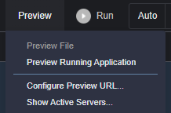

# AWS CodePipeline, Amazon RDS, Terraform을 사용하여 AWS App Runner에 Spring PetClinic 애플리케이션 빌드 및 배포 


[](https://gitpod.io/#https://github.com/aws/aws-cdk)
[](https://badge.fury.io/js/aws-cdk)
[](https://badge.fury.io/py/aws-cdk.core)
[](https://badge.fury.io/nu/Amazon.CDK)

## 개요

AWS App Runner, Amazon RDS, AWS CodePipeline, AWS CodeCommit, AWS CodeBuild 등 AWS CI/CD 툴을 사용하여 엔지니어가 서버리스 컨테이너 워크로드를 위한 파이프라인을 구축할 수 있도록 한다.   
   
[AWS App Runner](https://aws.amazon.com/apprunner/) 는 컨테이너형 웹 애플리케이션을 규모에 맞게 배포 및 실행하기 위한 AWS 모범 사례와 기술을 활용한다.   
이를 통해 새로운 애플리케이션 및 기능을 출시하는데 소요되는 시간을 대폭 단축된다.   
   
App Runner는 AWS ECS와 Fargate 위에서 실행되고, 휠씬 더 쉬운 접근성과 비용 추정이 간단하다.(초당 고정 CPU/메모리 요금 부과)   

## 배경

스프링 프레임워크는 다양한 유형의 산업 애플리케이션을 구축하기 위해 독립적/집합적으로 사용될 수 있는데 초점을 맞추고 느슨하게 결합된 작은 자바 프레임워크의 집합이다.   
   
스프링 펫클리닉 샘플 애플리케이션은 스프링 애플리케이션 프레임워크를 사용하여 단순하지만 강력한 데이터베이스 지향 애플리케이션을 구축하는 방법을 보여주기 위해 설계되었다.   
   
백엔드는 AWS RDS(MySQL)를 사용하며 스프링의 핵심 기능 활용을 시연한다.   

## 기여자

1. Irshad A Buchh, Amazon Web Services (https://github.com/aws-samples/aws-apprunner-terraform)
2. relaxmanitstime

## 아키텍처


## 사전 준비 사항

### AWS account

Administrator 권한이 있는 AWS 계정   
(참고. 운영 환경에서는 파이프라인 운영에 필요한 최소한의 권한으로 해야 함)   

### AWS Cloud9 환경 생성

AWS 관리 콘솔에 로그인 후 Cloud9 서비스를 검색 후 실행하여 ap-northeast-1 도쿄 리전에서 Amazon Linux2 기반으로 환경을 구성한다. 여기서는 t3.medium으로 선택한다. 참고로 AWS App Runner는 22-08-05 기준으로 서울 리전에서는 사용할 수 없다.      

### AWS Cloud9 환경 구성

AWS Cloud9 IDE를 실행 후 Welcome 탭을 닫고 새 터미널 탭을 연다.   


#### Cloud9 인스턴스에 대한 IAM 역할 생성 및 연결

기본적으로, Cloud9은 임시 IAM 자격 증명을 관리하나, 테라폼과 호환되지 않는다.   
Cloud9 임시 자격 증명을 사용하지 않도록 설정하고 Cloud9 인스턴스에 대한 IAM 역할을 생성 후 연결해야 한다.   

1. Follow [this deep link to create an IAM role with Administrator access.](https://console.aws.amazon.com/iam/home#/roles$new?step=review&commonUseCase=EC2%2BEC2&selectedUseCase=EC2&policies=arn:aws:iam::aws:policy%2FAdministratorAccess)
1. Confirm that **AWS service** and **EC2** are selected, then click **Next** to view permissions.
1. Confirm that **AdministratorAccess** is checked, then click **Next: Tags** to assign tags.
1. Take the defaults, and click **Next: Review** to review.
1. Enter **workshop-admin** for the Name, and click **Create role**.

1. Follow [this deep link to find your Cloud9 EC2 instance](https://console.aws.amazon.com/ec2/v2/home?#Instances:tag:Name=aws-cloud9-;sort=desc:launchTime)
1. Select the instance, then choose **Actions / Security / Modify IAM Role**. Note: If you cannot find this menu option, then look under **Actions / Instance Settings / Modify IAM Role** instead.

1. Choose **workshop-admin** from the **IAM Role** drop down, and select **Save**

1. Return to your Cloud9 workspace and click the gear icon (in top right corner), or click to open a new tab and choose "Open Preferences"
1. Select **AWS SETTINGS**
1. Turn off **AWS managed temporary credentials**
1. Close the Preferences tab

1. In the Cloud9 terminal pane, execute the command:
    ```bash
    rm -vf ${HOME}/.aws/credentials
    ```
1. As a final check, use the [GetCallerIdentity](https://docs.aws.amazon.com/cli/latest/reference/sts/get-caller-identity.html) CLI command to validate that the Cloud9 IDE is using the correct IAM role.
    ```bash
    aws sts get-caller-identity --query Arn | grep workshop-admin -q && echo "IAM role valid" || echo "IAM role NOT valid"
    ```

#### awscli 설정

```bash
curl "https://awscli.amazonaws.com/awscli-exe-linux-x86_64.zip" -o "awscliv2.zip"
unzip awscliv2.zip
sudo ./aws/install
```

설치 후 탭을 새로 연다.   

```bash
aws --version
pip install awscli --upgrade --user
```

aws configure를 통해 아래처럼 설정한다.      

```
admin:~/environment $ aws configure
AWS Access Key ID [None]: 
AWS Secret Access Key [None]: 
Default region name [None]: ap-northeast-1
Default output format [None]: 
```

#### 테라폼 설치

```bash
sudo yum install -y yum-utils
sudo yum-config-manager --add-repo https://rpm.releases.hashicorp.com/AmazonLinux/hashicorp.repo
sudo yum -y install terraform

terraform version
```

#### Apache Maven 설치 및 설정

아래와 같이 설치한다.   

```bash
cd /tmp
sudo wget https://archive.apache.org/dist/maven/maven-3/3.8.1/binaries/apache-maven-3.8.1-bin.tar.gz
sudo tar xf /tmp/apache-maven-*.tar.gz -C /opt
sudo ln -s /opt/apache-maven-3.8.1 /opt/maven
```

아래와 같이 bash 설정으로 들어간 후,   

```bash
sudo nano ~/.bashrc
```

파일 끝에 다음을 붙여넣고 저장 후 빠져나온다.   

```bash
export M2_HOME=/opt/maven
export MAVEN_HOME=/opt/maven
export PATH=${M2_HOME}/bin:${PATH}
```

아래와 같이 설치되었음을 확인한다.   

```bash
source ~/.bashrc
mvn --version
```

#### 리포지토리 클론
<!---
You will need to import the workshop files into your Cloud9 environment:

```bash
wget https://github.com/aws-samples/aws-ecs-cicd-terraform/archive/master.zip
unzip master.zip
cd aws-ecs-cicd-terraform-master
```
-->

소스 코드 리포지토리를 클론한다.   

```bash
cd ~/environment
git clone https://github.com/relaxmanitstime/aws-apprunner-terraform.git
```

## Apache Maven을 이용하여 응용 프로그램 패키징

아래 명령을 처음 실행할 때 메이븐은 필요한 플러그인과 관련 종속성을 다운로드하는 데 시간이 걸린다.(5분 이상)   
이후에는 다운로드할 필요가 없어서 더 빨리 실행한다.   
컴파일된 자바 클래스는 spring-petclinic/target/classes에 배치된다.   

```bash
cd ~/environment/aws-apprunner-terraform/petclinic
mvn package -Dmaven.test.skip=true
```

## Petclinic 도커 이미지 빌드 및 태그 지정

```bash
docker build -t petclinic .
```

## Petclinic 애플리케이션을 로컬로 실행

```bash
docker run -it --rm -p 8080:80 --name petclinic petclinic
```


컨테이너 80 포트를 사용하여 애플리케이션이 실행되고, 호스트 8080 포트에 노출된다.   
상단 메뉴 `Preview` 메뉴의 `Preview Running Application`을 클릭하면, 스프링 펫클리닉 애플리케이션을 표시하는 브라우저가 열린다.   



## Petclinic 도커 이미지를 Amazon ECR에 푸시
새 터미널을 열고, 다음을 실행한다.   

```bash
AWS_ACCOUNT_ID=$(aws sts get-caller-identity --query 'Account' --output text)
AWS_REGION=$(aws configure get region)

export REPOSITORY_NAME=petclinic
export IMAGE_NAME=petclinic

aws ecr create-repository \
    --repository-name $REPOSITORY_NAME \
    --image-scanning-configuration scanOnPush=true \
    --region $AWS_REGION
	
aws ecr get-login-password --region $AWS_REGION | docker login --username AWS --password-stdin $AWS_ACCOUNT_ID.dkr.ecr.$AWS_REGION.amazonaws.com

docker tag $IMAGE_NAME $AWS_ACCOUNT_ID.dkr.ecr.$AWS_REGION.amazonaws.com/$IMAGE_NAME
docker push $AWS_ACCOUNT_ID.dkr.ecr.$AWS_REGION.amazonaws.com/$IMAGE_NAME
```

그 후, AWS ECR의 리포지토리 메뉴로 가서 petclinic을 삭제한다.(이후 테라폼에서 에러 발생 방지 목적)   

## 인프라 및 파이프라인 구축

테라폼을 사용해 AWS Code Pipeline을 포함한 아키텍처를 구축한다.(유료 리소스를 생성하므로 비용절감을 위해 향후 리소스를 정리하는 것이 좋다.)   

### DB 암호에 대한 SSM 매개변수 설정

```bash
aws ssm put-parameter --name /database/password --value mysqlpassword --type SecureString
```

### 테라폼 변수 편집

```bash
cd ~/environment/aws-apprunner-terraform/terraform
```

terraform.tfvars 파일을 수정한다.   
- aws_profile은 "default" 그대로 둔다.   
- aws_region은 "ap-northeast-1"으로 수정하고,   
- codebuild_cache_bucket_name의 apprunner-cache-yyyymmdd-identifier 중 가운데 yyyymmdd는 오늘 날짜로, identifier는 사용자 고유한 이름으로 수정한다.   

S3 버킷의 이름은 전역적으로 고유해야 하고, 숫자, 소문자, 하이픈이 포함될 수 있다.   

### 빌드

테라폼을 초기화한다.   

```bash
terraform init
```

테라폼을 사용하여 인프라 및 파이프라인을 구축한다.   

```bash
terraform apply
```

깃 이메일과 사용자 계정 입력 후 테라폼 실행 계획이 표시된다.   
작업을 계속할지 묻는 메세지가 나오면 `yes`를 입력한다.   

“terraform apply”을 완료하는 데 몇 분 정도 걸린다.   

### Explore the stack you have built

Once the build is complete, you can explore your environment using the AWS console:
- View the App Runner service using the [AWS App Runner console](https://console.aws.amazon.com/apprunner/)
- View the RDS database using the [Amazon RDS console](https://console.aws.amazon.com/rds).
- View the ECR repo using the [Amazon ECR console](https://console.aws.amazon.com/ecr).
- View the CodeCommit repo using the [AWS CodeCommit console](https://console.aws.amazon.com/codecommit).
- View the CodeBuild project using the [AWS CodeBuild console](https://console.aws.amazon.com/codebuild).
- View the pipeline using the [AWS CodePipeline console](https://console.aws.amazon.com/codepipeline).


Note that your pipeline starts in a failed state. That is because there is no code to build in the CodeCommit repo! In the next step you will push the petclinic app into the repo to trigger the pipeline.

### Explore the App Runner service
Open the App Runner service configuration file [terraform/services.tf](terraform/services.tf) file and explore the options specified in the file.

```typescript
 image_repository {
      image_configuration {
        port = var.container_port
        runtime_environment_variables = {
          "spring.datasource.username" : "${var.db_user}",
          "spring.datasource.password" : "${data.aws_ssm_parameter.dbpassword.value}",
          "spring.datasource.initialization-mode" : var.db_initialize_mode,
          "spring.profiles.active" : var.db_profile,
          "spring.datasource.url" : "jdbc:mysql://${aws_db_instance.db.address}/${var.db_name}"
        }
      }
      image_identifier      = "${data.aws_ecr_repository.image_repo.repository_url}:latest"
      image_repository_type = "ECR"
    }
```
**Note:** In a production environment it is a best practice to use a meaningful tag instead of using the `:latest` tag.

## 파이프라인을 사용하여 펫클리닉 애플리케이션 배포

깃으로 푸시하여 파이프라인을 통해 펫클리닉 애플리케이션을 배포한다.    

### 펫클리닉 애플리케이션을 위한 로컬 깃 리포 설정

```bash
cd ~/environment/aws-apprunner-terraform/petclinic
```

깃 사용자 이름과 이메일 주소를 설정한다.   

```bash
git config --global user.name "YourName"
git config --global user.email "YourEmail@example.com"
```

다음과 같이 펫클리닉을 위한 로컬 깃 리포를 만든다.   

```bash
git init
git add .
git commit -m "Baseline commit"
```

### 리모트 코드커밋 리포를 설정

너가 만든 파이프라인의 일부로 AWS CodeCommit Repo가 만들어졌다.   
이제 로컬 펫클리닉 리포에 대한 리모트 리포를 설정할 것이다.   

인증을 위해 AWS IAM git credential helper를 사용해 IAM 역할 사용 권한에 따라 Git 자격 증명을 생성할 수 있다.   

```bash
git config --global credential.helper '!aws codecommit credential-helper $@'
git config --global credential.UseHttpPath true
```

테라폼 빌드의 아웃풋으로부터 다음 단계에서 사용할 `source_repo_clone_url_http`을 사용한다.   

```bash
cd ~/environment/aws-apprunner-terraform/terraform
export tf_source_repo_clone_url_http=$(terraform output --raw source_repo_clone_url_http)
```

깃 리포를 위한 리모트를 설정한다.   

```bash
cd ~/environment/aws-apprunner-terraform/petclinic
git remote add origin $tf_source_repo_clone_url_http
git remote -v
```

아래와 같은 결과가 나와야 한다.   

```bash
origin  https://git-codecommit.eu-west-2.amazonaws.com/v1/repos/petclinic (fetch)
origin  https://git-codecommit.eu-west-2.amazonaws.com/v1/repos/petclinic (push)
```

### 파이프라인 실행(트리거)

파이프라인을 실행하기 위해서 리모트에 마스터 브랜치를 푸시한다.   

```bash
git push -u origin master
```

파이프라인은 코드를 pull하고, 도커 이미지를 빌드 및 ECR에 푸시하고, ECS 클러스터에 배포한다.   
이 작업은 몇 분 정도 걸린다.   
[AWS CodePipeline console](https://console.aws.amazon.com/codepipeline) 에서 파이프라인을 모니터링할 수 있다.   

### Test the application

From the output of the Terraform build, note the Terraform output `apprunner_service_url`.

```bash
cd ~/environment/aws-apprunner-terraform/terraform
export tf_apprunner_service_url=$(terraform output apprunner_service_url)
echo $tf_apprunner_service_url
```

Use this in your browser to access the application.


## Push a change through the pipeline and re-test

The pipeline can now be used to deploy any changes to the application.

You can try this out by changing the welcome message as follows:

```
cd ~/environment/aws-apprunner-terraform/petclinic
vi src/main/resources/messages/messages.properties
```
Change the value for the welcome string, for example, to "Hello".

Commit the change:

```
git add .
git commit -m "Changed welcome string"
```

Push the change to trigger pipeline:

```bash
git push origin master
```

As before, you can use the console to observe the progression of the change through the pipeline. Once done, verify that the application is working with the modified welcome message.

## Tearing down the stack

**Note:** If you are participating in this workshop at an AWS-hosted event using Event Engine and a provided AWS account, you do not need to complete this step. We will cleanup all managed accounts afterwards on your behalf.

Make sure that you remember to tear down the stack when finshed to avoid unnecessary charges. You can free up resources as follows:

```
cd ~/environment/aws-apprunner-terraform/terraform
terraform destroy
```

When prompted enter `yes` to allow the stack termination to proceed.

Once complete, note that you will have to manually empty and delete the S3 bucket used by the pipeline.

## Delete the Amazon ECR

```bash
aws ecr delete-repository \
    --repository-name $REPOSITORY_NAME \
	--region $AWS_REGION \
    --force
```
